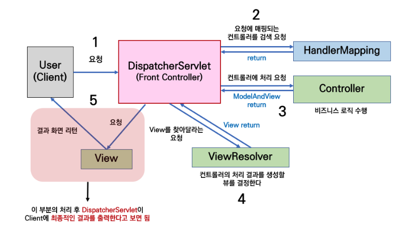

### MVC (Pattern)이란?

- Model View Controller 를 이용해서 프로그래밍하는 소프트웨어 설계 방법. 이러한 방법을 MVC 디자인 
패턴이라 함.
    - Model : 데이터베이스와 밀접한 관계를 갖고 비즈니스 로직을 담당
    - View : 클라이언트와 밀접한 관계를 갖고 비즈니스 로직의 결과를 출력하기 위한 화면 구성 담당
    - Controller : 클라이언트의 요청에 대해 (비즈니스로직을 처리하는) Model — (화면 구성을 담당) View
                        를 컨트롤 하는 역할

### MVC 의 흐름

`MVC`

- User(Client)의 요청이 들어오면 DispatcherServlet 요청을 받음.
    - DispatcherServlet 는 클라이언트의 요청을 분석하여 적합한 컨트롤러 탐색
    - 컨트롤러를 직접 탐색하는것이 아닌, HandlerMapping에 요청에 매핑되는 컨트롤러 검색을 요청함
    - 요청을 받은 HandlerMapping은 클라이언트 요청에 적합한 컨트롤러 객체를 Return
    - DispatcherServlet 해당 컨트롤러객체(=클라이언트 요청에 적합한 컨트롤러)호출 
    (호출할 때, HandlerAdapter을 통해서 호출)
    - Controller에서는 요청에대한 비즈니스로직을 처리한 후, HandlerAdaper에 처리 결과 Return
    - 처리 과정에서 ModelAnd View 객체를 사용
        - ModelAndView는 처리 결과의 데이터와 View 정보를 가지고 있음.
        - 컨트롤러에서 반환할때 ModelAndView 클래스를 이용할 수도 있고, View 따고 Model 따로도 
        가능
- DispatcherServlet는 클라이언트 요청을 처리한 결과 ,결과에 적합한 View를 찾기 위한 ViewResolver 
객체 이용
    - DispatcherServelt는 ViewResolver에 처리 결과에 적합한 View를 찾아달라는 Request
    - Response로 ViewResolver 객체가 응답에 적합한 뷰를 생성하면 DispatcherServlet에 Return
        - 이 과정에서 ModelAndView객체에 담겨있는 View 정보를 이용함.
- DispatcherServlet는 ViewResolver 객체가 보내준 View 정보를 이용해 View 객체를 준비 , 응답결과를 Return.

`DispatcherServlet` 

```java
/*HttpServert 상속받아 Servlet 기능을 수행(웹 여청 처리) 
HttpServert를 상속받으면, HTTP 요청의 매서드 타입(Get, Put, Post, Delete) 처리할 수 있음.
HTTP프로토콜을 사용해 클라이언트와 서버간의 통신 담당
HttpServert를 상속받은 MyDispatcherServlet클래스는 Tomcat 같은 웹 컨테이너에 의해 실행
*/
// MyDispatcherServlet 클래스
public class MyDispatcherServlet extends HttpServlet {

    private HandlerMapping handlerMapping;
    private ViewResolver viewResolver;

    @Override
    public void init() {
        this.handlerMapping = new SimpleUrlHandlerMapping(); // HandlerMapping 설정
        this.viewResolver = new InternalResourceViewResolver(); // ViewResolver 설정
    }

    @Override
    public void doGet(HttpServletRequest request, HttpServletResponse response) throws ServletException, IOException {
        // 요청에 적합한 컨트롤러 탐색
        Object handler = handlerMapping.getHandler(request);

        if (handler == null) {
            response.sendError(HttpServletResponse.SC_NOT_FOUND); // Controller가 없는 경우 404 에러 반환
            return;
        }

        // HandlerAdapter를 통해 컨트롤러 호출
        HandlerAdapter handlerAdapter = new SimpleControllerHandlerAdapter();
        ModelAndView modelAndView = handlerAdapter.handle(request, response, handler);

        View view = viewResolver.resolveViewName(modelAndView.getViewName(), request.getLocale());

        // View 객체를 이용해 응답 준비 및 반환
        view.render(modelAndView.getModel(), request, response);
    }
}

// Controller 인터페이스
public interface Controller {
    ModelAndView handleRequest(HttpServletRequest request, HttpServletResponse response) throws Exception;
}

// SampleController 클래스 - Controller 인터페이스 구현
public class SampleController implements Controller {
    @Override
    public ModelAndView handleRequest(HttpServletRequest request, HttpServletResponse response) throws Exception {
        // 클라이언트가 전송한 name 파라미터를 사용하여 메시지 생성
        String message = "Hello, " + request.getParameter("name"); // 예: "name" 값이 Alice라면 "Hello, Alice" 생성
        
        // View 이름을 "greetingView"로 설정하고 모델 데이터에 메시지 추가
        ModelAndView mav = new ModelAndView("greetingView");
        mav.addObject("message", message); // "message"라는 키로 생성된 메시지를 모델에 추가
        return mav;
    }
}

// ViewResolver 구현
public class InternalResourceViewResolver implements ViewResolver {
    @Override
    public View resolveViewName(String viewName, Locale locale) {
        // 전달받은 viewName을 기반으로 JSP 파일 경로를 설정
        return new JspView("/WEB-INF/views/" + viewName + ".jsp"); // 예: "greetingView" -> "/WEB-INF/views/greetingView.jsp"
    }
}

// View 인터페이스
public interface View {
    void render(Map<String, ?> model, HttpServletRequest request, HttpServletResponse response) throws Exception;
}

// JSP View 클래스 - View 인터페이스 구현
public class JspView implements View {
    private String url;

    public JspView(String url) {
        this.url = url;
    }

    @Override
    public void render(Map<String, ?> model, HttpServletRequest request, HttpServletResponse response) throws Exception {
        // 모델 데이터를 요청 속성에 추가하여 JSP에서 사용할 수 있도록 설정
        for (Map.Entry<String, ?> entry : model.entrySet()) {
            request.setAttribute(entry.getKey(), entry.getValue());
        }
        // 설정된 JSP 경로로 포워딩하여 클라이언트에 HTML 응답 생성
        request.getRequestDispatcher(url).forward(request, response);
    }
}

```