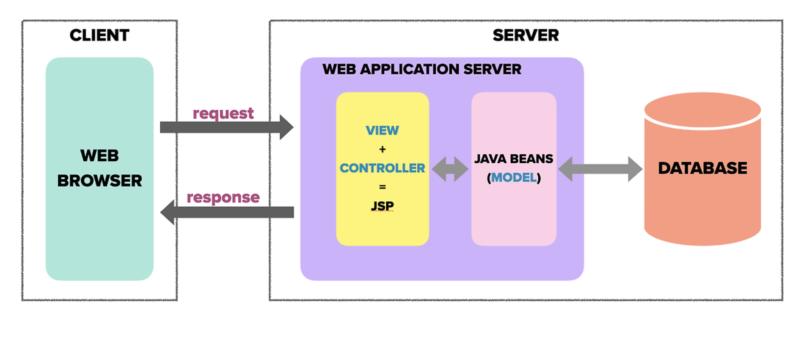
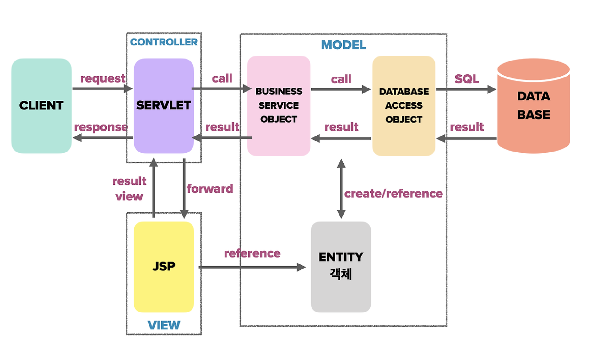

## Model 1 Architecture & Model 2 Architecture

JSP를 이용하여 구성할 수 있는 (Web)App Server 는 Model1/2 Architecture 로 처리를 수행.
Model1 은, JSP가 Client 요청에 대한 로직처리와 View(response Page)에 대한 처리를 모두 수행.

Model2 은, JSP가 View에 대한 처리만 수행 (= MVC(Model View Controller) Pattern을 웹 개발에 도입한 구조)

`Model1 Architecture`

- 1) Client (Web) → App Server에 Request 전송
- 2) Controller가 요청을 받아 필요한 데이터를 JavaBeans (Model)에서 가져옴
- 3) JavaBeans (Model)는 데이터베이스와 상호작용하여 데이터를 처리
- 4) Controller가 받은 데이터를 View에서 화면으로 생성하여 Client에 응답(Response)

**[  View / Controller (logic)을 JSP 페이지 하나에서 처리하는 구조]**

> 단점: (Logic을 구현하는)Back / (View를 구현하는) Frontend , Frontend와 Back을 JSP 페이지 하나에서 처리하기에, JSP 코드에 혼재되어 있어, 분업이 힘듬 .
확장성이 나쁨.
> 

> 장점: 구조가 단순하여 직관적
> 

`Model2 Architecture`

- 1) Client (Web) → Servlet(Controller): Client 로 부터 요청을 받고, 이 요청이 
Servlet(Controller)으로 전달. 
해당 구조에서 Servlet Controller 역할로 , 요청을 받아 처리할 서비스를 결정하고 필요한 데이터를 조회 (→Business Service Object)
    - Business Service Object: ****비즈니스 로직을 담당하며, 요청된 기능을 수행하기 위해 필요한 데이터나 추가 처리를 정의
- 2) Business Service Object (Model) → Database Access Object (Model)
    - 데이터베이스와 상호작용이 필요시(비즈니스 로직을 수행하기 위해) DAO 호출
    - DAO : 데이터 베이스와 직접 상호작용하는 객체 SQL 쿼리를 통해 데이터를 조회하거나저장
- 3) DAO → Database
    - **DAO**는 데이터베이스와 SQL 쿼리를 통해 통신하여 필요한 데이터를 가져오거나 저장
    - Database로부터 결과를 받아 다시 DAO 전달
- 4) Business Service Object (Model) →Servlet → JSP(View)
    - 처리된 결과를 **Controller(Servlet)**로 반환
    - **Controller**는 결과를 **JSP(View)**로 **forward(포워드)**
    - **JSP**는 사용자가 보게 될 화면을 생성. 이때 필요한 데이터를 **Entity** 객체로 참조(reference)하여 가져올 수  있음.
    - JSP (View) 생성된 화면이 응답를 통해 Client에 전달됨. Client는 처리 결과를  View로부터 볼수있음.

**Entity 객체**는 비즈니스 객체에 의해 참조될 수 있는 데이터 객체. 보통 데이터베이스의 테이블과 매핑되어 데이터를 저장하는 객체

### 비즈니스 로직 / 프레젠테이션 로직

비즈니스 로직 : 

- 웹 애플리케이션에서 클라이언트의 요청을 처리하는 핵심 업무
(e.g. 사용자가 로그인을 시도할 때 아이디와 비밀번호를 확인하고 인증 → 이 일련의 과정을 비즈니스 로직)
- 데이터 베이스와 상호작용  MVC 패턴에서 Model이 비즈니스 로직

프레젠테이션 로직 :

- 비즈니스 로직에서 처리한 결과를 클라이언트에게 보여주는 화면 구성
- 사용자 인터페이스와 상호작용하며 MVC 패턴에서 View